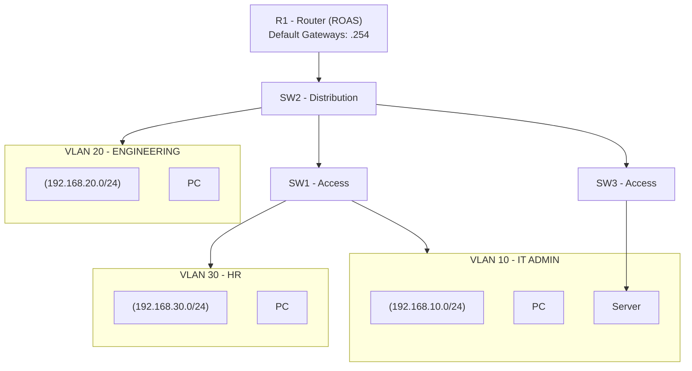

# CCNA Project 01 – VLAN Segmentation and Router-on-a-Stick (Hardened Campus Access Design)

## 1. Project Objective

Design and implement a segmented enterprise LAN using VLANs and inter-VLAN routing through **Router-on-a-Stick (ROAS)**.

The project focused on building core campus access-layer fundamentals, including **VLAN segmentation, trunk configuration, management plane separation, and Layer 2 edge protections**, to simulate practical enterprise network design and hardening concepts.


---

## 2. Topology Overview

**Architecture Model:**
- R1 – Inter-VLAN Router (ROAS)
- SW2 – Distribution Layer Switch
- SW1 / SW3 – Access Layer Switches
- Department-based VLAN segmentation
- Dedicated Management VLAN

### Physical Topology
   

### Architecture Rationale

A traditional three-tier campus model was simulated:

- Access Layer: End device connectivity and edge protection
- Distribution Layer: Aggregation and VLAN trunking
- Routing Layer: Inter-VLAN routing via ROAS

This separation reflects enterprise campus network design principles.


### Logical Topology

**Design Notes:**
- Inter-VLAN routing via Router-on-a-Stick (802.1Q)
- Trunks carry VLANs 10,20,30,99 (native VLAN 999)
- SW2 acts as distribution layer
- VLAN 99 used for management plane separation

---

## 3. VLAN & IP Addressing Plan

| VLAN | Name | Subnet | Default Gateway |
|------|------|--------|-----------------|
| 10 | IT-ADMIN | 192.168.10.0/24 | 192.168.10.254 |
| 20 | ENGINEERING | 192.168.20.0/24 | 192.168.20.254 |
| 30 | HR | 192.168.30.0/24 | 192.168.30.254 |
| 99 | MANAGEMENT | 192.168.99.0/24 | 192.168.99.254 |
| 999 | NATIVE-BLACKHOLE | (No hosts) | N/A |

### Design Notes

- Each department is isolated in its own VLAN.
- Inter-VLAN routing is handled by R1 subinterfaces using 802.1Q tagging.
- VLAN 99 separates management traffic from user data.
- VLAN 999 is used as a non-user native VLAN to mitigate VLAN hopping risks.

---

## 4. Key Configuration Highlights

### Router-on-a-Stick (R1)
```cisco
interface GigabitEthernet0/0.10
 encapsulation dot1Q 10
 ip address 192.168.10.254 255.255.255.0

interface GigabitEthernet0/0.20
 encapsulation dot1Q 20
 ip address 192.168.20.254 255.255.255.0

interface GigabitEthernet0/0.30
 encapsulation dot1Q 30
 ip address 192.168.30.254 255.255.255.0

interface GigabitEthernet0/0.99
 encapsulation dot1Q 99
 ip address 192.168.99.254 255.255.255.0

interface GigabitEthernet0/0.999
 encapsulation dot1Q 999 native
```

### Trunk Hardening (All Trunk Links)
```cisco
switchport mode trunk
switchport trunk allowed vlan 10,20,30,99
switchport trunk native vlan 999
switchport nonegotiate
```
  - Explicit VLAN allow list
  - Native VLAN isolation
  - DTP disabled to prevent automatic trunk negotiation

### Access Layer Hardening
```cisco
spanning-tree portfast
spanning-tree bpduguard enable
```
  - PortFast enabled on edge ports to reduce STP delay
  - BPDU Guard enabled to protect against rogue switch connections
  - Unused ports administratively shutdown

### Management VLAN Configuration (Example)
```cisco
interface Vlan99
 ip address 192.168.99.12 255.255.255.0
 no shutdown

ip default-gateway 192.168.99.254                                                       
```

---

## 5. Validation & Verification
   The following commands were used to validate proper operation:

### Layer 2 Validation
  - `show interfaces trunk`
  - `show vlan brief`
  - `show spanning-tree summary`

### Layer 3 Validation
  - `show ip interface brief`
  - `show ip route`

### Connectivity Testing
  - Successful ping between hosts in different VLANs
  - Successful ping to respective default gateways
  - Successful ping to management gateway (192.168.99.254)

Validation outputs and ping results are documented in the `/validation` directory.

---

## 6. Troubleshooting Scenarios
   ### Scenario 1 – Host Cannot Reach Gateway                                     
   **Cause:** Incorrect access VLAN assignment                                      
   **Resolution:** Reassign correct VLAN using `switchport access vlan X`                              
 
   ### Scenario 2 – Inter-VLAN Routing Failure                                                      
   **Cause:** Missing or incorrect `encapsulation dot1Q` on router subinterface                                                 
   **Resolution:** Configure correct VLAN ID on subinterface                                        

   ### Scenario 3 – Native VLAN Mismatch                                   
   **Cause:** Native VLAN not aligned on trunk links                                 
   **Resolution:** Set `switchport trunk native vlan 999` consistently                         

   ### Scenario 4 – Trunk Not Passing VLAN                            
   **Cause:** VLAN not included in allowed list                            
   **Resolution:** Update `switchport trunk allowed vlan` configuration                            

   ### Scenario 5 – Management VLAN Unreachable                              
   **Cause:** VLAN 99 not configured or not active on trunk                              
   **Resolution:** Create VLAN 99 and ensure it is allowed on trunks                                  

---

## 7. Lessons Learned
  - Router-on-a-Stick is suitable for small environments but does not scale compared to multilayer switching.
  - Consistent VLAN configuration across all switches is critical.
  - Native VLAN should never carry user traffic.
  - Management plane must be isolated from data plane.
  - Trunk hardening prevents unintended VLAN propagation.
  - STP should never be globally disabled in production environments.
  - Structured validation commands are essential for troubleshooting.
    
---

## 8. Skills Demonstrated
  - VLAN segmentation
  - Router-on-a-Stick implementation
  - 802.1Q trunk configuration
  - Inter-VLAN routing
  - Layer 2 hardening (PortFast, BPDU Guard)
  - Management VLAN implementation
  - Network validation and structured troubleshooting

---

## 9. Tools Used
  - Cisco Packet Tracer
  - CLI-based configuration and validation
